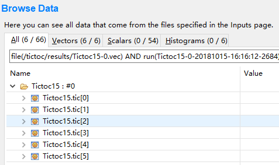
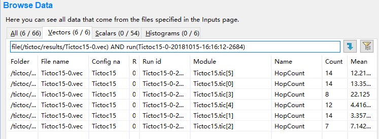
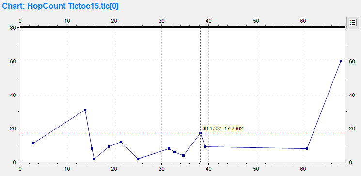
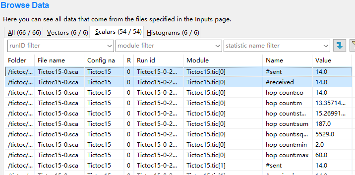
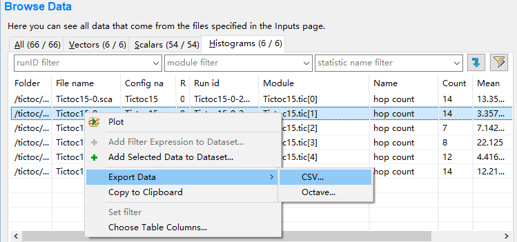
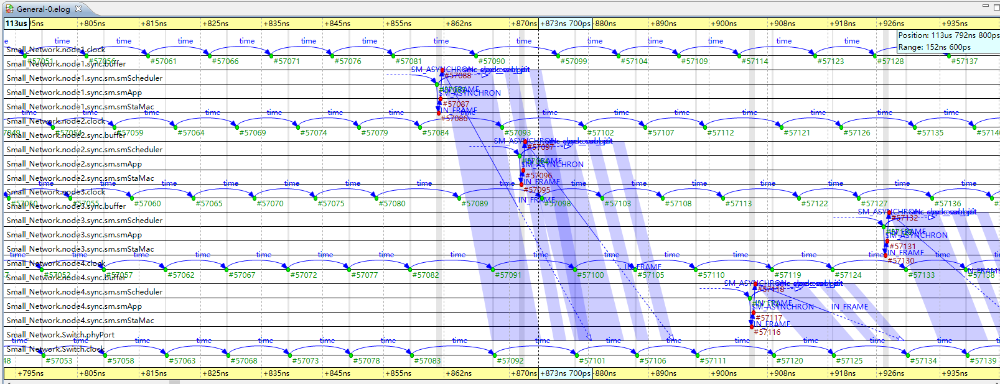

# 数据统计与仿真分析 #

&#160; &#160; &#160; &#160;<b>OMNeT++</b>有诸多工具对网络代码中统计的标量和矢量进行数据分析。 
&#160; &#160; &#160; &#160;本章以一个<b>AFDX</b>网络的<b>RC</b>和<b>BE</b>消息的仿真结果为前提，依赖<b>OMNeT++</b>自带的工具集对这些结果进行分析，重点主要放在如何设置需要统计的标量和矢量？如何对最后的仿真结果进行操作得到我们想要的散点图、直方图等其他便于分析的数据图形。

## 仿真结果有哪些 ##

&#160; &#160; &#160; &#160;先备注一下，每次运行完仿真后，将会产生三个文件：
<b>.sca .vci .vec</b>，点击<b>.vec</b>文件将会生成<b>.anf</b>文件，这个<b>.anf</b>文件当我们下一次重新运行仿真程序的时候，会更新，不需要删除后执行仿真程序。

## 仿真结果的获取 ##

&#160; &#160; &#160; &#160;在平常各种各样的仿真实验中，首先我们需要去获取所需的结果信息。在<b>OMNeT++</b>中有以下几种常用的获取仿真结果的方式，这里同时简单描述一下它们的用法。

- cLongHistogram：记录数据然后实现等距直方图  
定义：cLongHistogram hopCountStats;
我们可以对名称进行设置，如hopCountStats.setName(“hopcountStats”);
设置上限值：hopCountStats.setRangeAutoUpper(“0,10,1.5”);
记录数据：hopCountStats.collect(hopcount);
一些其他的属性如getMin()、getMax()、getMean()以及getStddev()，不做赘述。

- cOutVector：获取输出向量 
定义：cOutVector hopCountVector;
同样可以人为地对名称进行设置，比如hopCountVector.setName(“Hopcount”);
记录数据：hopCountVector.record(hopcount);
其中，record表示记录数据。缺少这一语句的话，不会有任何的数据输出。

- recordScalar 
输出程序中某个标量的值，直接调用即可。即
recordScalar(“string 输出名称”, 输出变量名);
仿真之后的result文件中会有以“string 输出名称”命名的文件。“输出变量名”为我们要输出查看的变量。recordScalar较为简单，一般在Finish()函数中使用。

## 仿真结果分析 ##

&#160; &#160; &#160; &#160;每次仿真的结果都会存储在project下面的result文件夹中。
cOutVector: \result\xxx.vec
cLongHistogram: \result\xxx.sca

<b>图6-1 doc目录</b>

&#160; &#160; &#160; &#160;如图所示，<b>Project Explorer</b>中选中的文件就是我们的仿真结果。之后双击打开就可以查看里面的内容，这里我选择打开了<b>vec</b>文件。

<b>图6-2 doc目录</b>

然后会让我们建立新的分析文件。点击finish即可

<b>图6-3 doc目录</b>

点击打开Data栏中vec下属的记录。Tictoc15网络中有6个节点，可以看到仿真对它们全部进行了记录

<b>图6-4 doc目录</b>

<b>图6-5 doc目录</b>

其实，观察选项卡就可以发现，这里我们就可以查看所有的结果了。由于笔者打开的是vec文件，所以只有输出向量。

<b>图6-6 doc目录</b>

双击打开想查看的一行，如下所示：

<b>图6-7 doc目录</b>

接下来我们打开sca文件查看直方图：

<b>图6-8 doc目录</b>

<b>图6-9 doc目录</b>

可以看到，如前文所述，文件名是匹配的

在Histogram栏中选中一条，并打开：

<b>图6-10 doc目录</b>

另外，我们也可以直接取出数据，方法如下：

<b>图5-11 doc目录</b>

之后可以自己进行数据处理和作图。

## 事件日志文件的使用 ##
&#160; &#160; &#160; &#160;事件日志文件（EventLog）所记录的内容包括用户仿真过程中各个模块发送的消息细节以及提示发送和消息接收的细节。在Tkenv界面进行仿真前，点击“Enable recording on/off”按钮，即可对仿真过程中的事件进行记录。

&#160; &#160; &#160; &#160;默认情况下，相应工程的result文件夹中会出现一个后缀为“.elog”的文件，即我们本次仿真记录所得的时间日志文件。这里需要特别注意的是，记录的数据数量会直接决定elog文件的大小，不仅会影响仿真的速度，还可能在仿真结束后，omnetpp无法打开过大的日志文件，导致闪退，严重时甚至出现过黑屏等情况。因此建议在使用时不要记录过长的时间或过多无用的内容。

### 序列图 ###
&#160; &#160; &#160; &#160;打开elog文件后，里面的内容会以序列图的形式来展现，如下图所示：

<b>图6-16 常用符号</b>

&#160; &#160; &#160; &#160;序列图可分为三个部分：上沿、主区域和下沿。其中，上下沿显示的是仿真时间轴。主区域则是显示各个模块名称和周线、时间与消息的发送。
下面是常用符号的图例：

<b>图6-16 常用符号</b>

### 事件日志表 ###
&#160; &#160; &#160; &#160;事件日志表的事件记录分为三栏，依次是事件编号、仿真时间和事件的具体细节。
善用过滤器来减少无用内容的显示对提高工作效率很有帮助，行过滤器可以过滤特定类型的显示行。同时，事件日志表支持导航历史纪录，每个用户停留超过三秒的位置都会被记录下来作为临时数据。

### 个人体会 ###
&#160; &#160; &#160; &#160;首先第一点，一定不要让elog文件的体积过大，因为这很可能导致处理过程中的闪退。
然后，过滤器是我最常用的功能。除了行过滤器外，序列图和事件日志表都支持同一个Filter。

如图所示，一般包括：
范围过滤器：过滤掉elog中的起始和结束事件，有助于减少计算时间。
模块过滤器：用户可以指定特定的模块，非指定模块的事件会被全部过滤。当我们倾向于研究一个或几个特定模块时，这非常有用。
消息过滤器：最复杂的一个过滤器。需要根据消息的C++名称、消息名称、消息id以及匹配表达式等进行选择。
因果过滤器：通过指定特定的事件并对其愿意和结果进行过滤。

&#160; &#160; &#160; &#160;同时，omnet++对filter结果的计算和显示会耗费大量的时间，一定要指定适当的范围。具体根据什么来设置范围，就要以各位各自的使用情况作为标准了。
