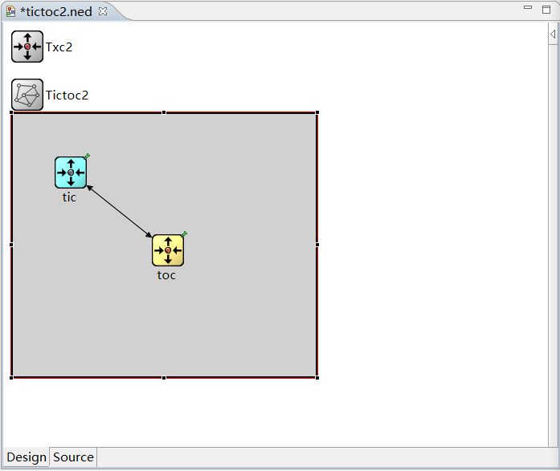
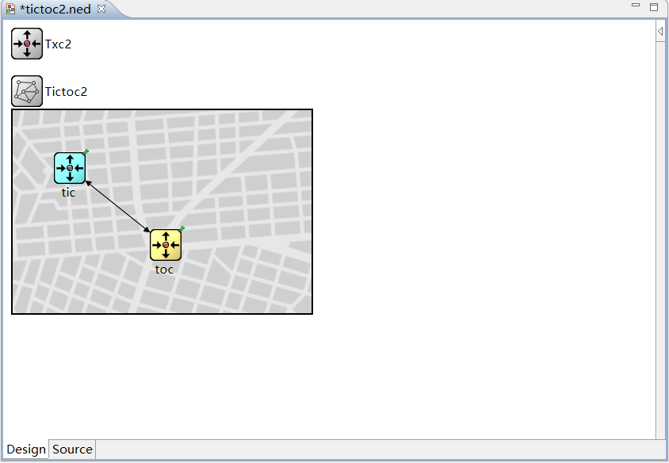
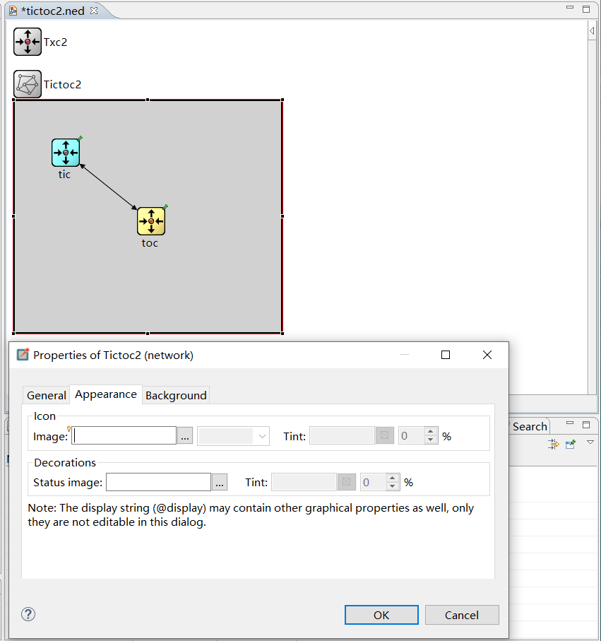
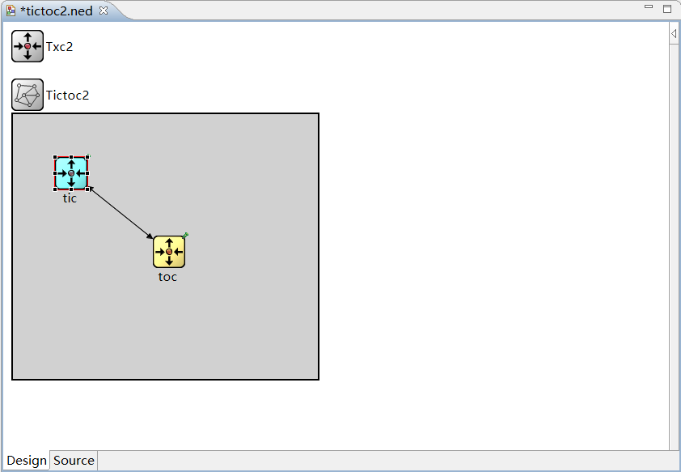
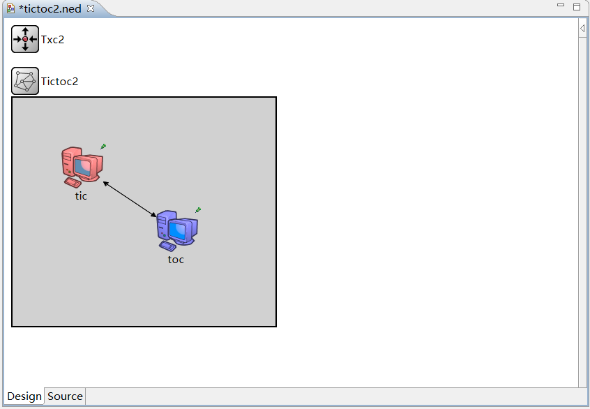
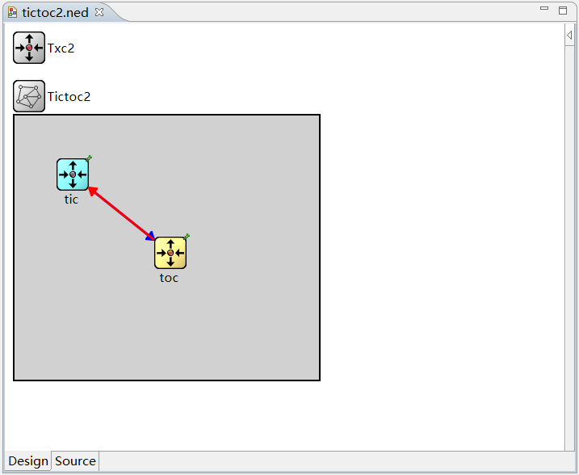

# 网络拓扑的个性化显示

在本小节，主要对网络拓扑的个性化显示进行简要介绍。OMNeT++作为一个面向对象的模块化离散事件网络仿真框架，能够在网络拓扑的显示上进行自定义的修改，其主要操作在.NED文件中进行。以下我们以tictoc 工程为例进行介绍和说明。

## 网络背景的个性化

1. 画布大小调整

   打开tictoc2.ned文件，切换到Design模式下，单击边框，边框变红，此时可以进行画布大小的调整和拖拽。



2. 画布背景图调整

   在画布区域任意位置右键，选择Properties，进入属性页，选择Background，可以进行定制化修改。



## 网络对外显示的调整

在画布区域任意位置右键，选择Properties，进入属性页。



可以在appearance属性下，定制整个网络对外的显示效果。

例如可以选择调整为如下图所示。


## 网络模块的显示调整

在网络或模块中可以对每个模块（包括简单模块和复合模块）进行显示的定制化。可以下载所需要的模块的图片，存放到omnet安装文件的 images 对应目录下。在模块的显示定义上进行定义。

如图所示，对tictoc2工程中的tic进行修改。



```
tic:Txc2{
  parameters:
    @display("i=,cyan;p=72,73");
}
toc:Txc2{
  parameters:
    @display("i=,gold,p=193,170");
}
```

对应在@display（）；进行修改，其中i=... 指定图片显示和颜色，p=...指定模块在画布中的位置。

```
tic: Txc2 {
  parameters:
    @display("i=device/pc2_l,red;p=100,100"); 
}
toc: Txc2 {
  parameters:
    @display("i=device/pc2_l,blue;p=236,191"); 
}
```

显示效果如下：



## 网络中连接的显示调整

网络中的连接也可进行个性化定制。

原始的connections：

```
connections:
  tic.out --> {  delay = 100ms; } --> toc.in;
  tic.in <-- {  delay = 100ms; } <-- toc.out;
```

调整：

```
connections:
  tic.out --> {  @display("ls=blue,3");delay = 100ms; } --> toc.in;
  tic.in <-- {  @display("ls=red,3");delay = 100ms; } <-- toc.out;

```

增加@display（）其中ls=...分别指定连接线显示的颜色和粗细。

效果：



## 本章小结 ##

本章主要对OMNeT++中网络拓扑个性化显示进行了简要说明。