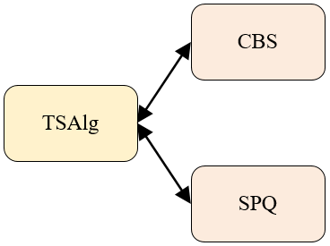

# 参数化子模块类型 #

在使用**OMNeT++**进行仿真建模时，模块与模块之间可通过使用接口的方式来提高代码效率。以下以某工程实例来进行简要介绍和说明。

## 模块关系说明 ##



如图所示，TSAlg提供了一个公用模块接口，CBS 和SPQ 分别为两种不同的子模块类型。在使用时，可通过使用关键字<font color="#FF0000" face="黑体">（like）</font>，以类型为string的模块参数来对子模块的类型进行指定。在.cc和.h文件中，将TSAlg作为父类，CBS和SPQ分别对父类TSAlg进行继承。 注意，以下的CBS可替换为SPQ。

例如在CBS.h中

```
...
#include "../TSAlgorithm.h"
...
class CBS:public TSAlgorithm{
...
}
```

在CBS.cc中

```
...
#include "CBS.h"
...

void CBS::initialize() {
    TSAlgorithm::initialize();
	...
}

void CBS::handleMessage(cMessage* msg) {
  ...
  TSAlgorithm::handleMessage(msg);
  ...
}
...
```

注意：需要对TSAlgorithm也进行初始化，即TSAlgorithm::initialize()。

## 使用方法一

Queuing是一个复合模块，两种不同的方法CBS和SPQ将在该复合模块中进行使用，在Queuing.ned文件中描述，

```
module Queuing
{
	parameters:
	...
	string CBS;
	...
	gates:
	...
	submodules:
	...
	  tsAlgorithms[numberOfQueues]: <CBS> like TSAlgorithm {
        @display("p=285.18002,365.302,r,150");
        schedulerModule = "^.tSchedulers[" + string(index) + "]";
        queueModule = "^.queues[" + string(index) + "]";
    }
    connections:
    ...
}
```

TSAlg为公用模块接口，CBS和SPQ为可替换的子模块。在上述代码中，通过使用关键字like来实现参数化子模块类型。like后 TSAlgorithm为公用接口，like前使用 <>，<>内以string类型的模块参数指定所使用的模块。

## 使用方法二

在<>内的表达式也可以不写，为空。而通过typename赋值的方式来指定子模块类型。

在.ned文件中

```
module Queuing
{
	parameters:
	...
	gates:
	...
	submodules:
	...
	  tsAlgorithms[numberOfQueues]: <> like TSAlgorithm {
        @display("p=285.18002,365.302,r,150");
        schedulerModule = "^.tSchedulers[" + string(index) + "]";
        queueModule = "^.queues[" + string(index) + "]";
    }
    connections:
    ...
}
```

在.ini文件中

```
**.switch*.eth[*].queuing.tsAlgorithms[*].typename = "CBS"
```

## 使用方法三

可以在使用中，也可以指定一个默认的子模块类型。通过使用default关键字来实现。具体代码如下所示。

```
module Queuing
{
	parameters:
	...
	string defaultTSAlg="CBS";
	...
	gates:
	...
	submodules:
	...
	  tsAlgorithms[numberOfQueues]: <default(defaultTSAlg)> like TSAlgorithm {
        @display("p=285.18002,365.302,r,150");
        schedulerModule = "^.tSchedulers[" + string(index) + "]";
        queueModule = "^.queues[" + string(index) + "]";
    }
    connections:
    ...
}
```

## 本章小结 ##

本章主要对OMNeT++中使用参数化子模块类型对代码进行简化进行了简要说明。
