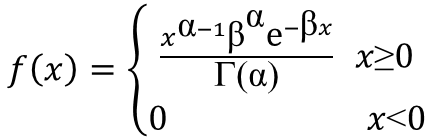
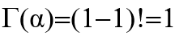
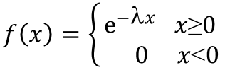
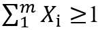
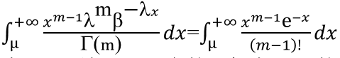
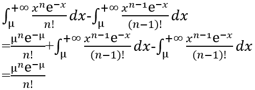

# 流量源模型

在进行网络仿真时，涉及多种不同消息达到模型。在本章节中，将简单介绍几种典型的流量到达模型。在OMNeT++中已经提供了几种常用的到达模型。通过将消息发送间隔与到达模型相结合，能够基本实现多种不同类型的流量源模型。以下以`INET`库中的源 `EtherTrafGen` 为例进行简要说明。

背景说明

在`INET`的`EtherTrafGen`源模型中，给出了消息模型的一些基本属性，如发送间隔（`sendInterval`）。

在`EtherTrafGen.h`中给出

```c++
class INET_API EtherTrafGen : public ApplicationBase{
...
    cPar *sendInterval = nullptr;
...
}
```

`cPar`指明将从`EtherTrafGen.ned`获取参数值，而 `EtherTrafGen.ned`又可以通过在`.ned`文件中指定或在工程的`.ini`文件中进行设定。

对应在`EtherTrafGen.ned`文件中

```
simple EtherTrafGen
{
    parameters:
    ...
    volatile double sendInterval @unit(s);  
    ...
}
```

这里的`volatile`使参数表达式在每次读参数的时候都重新进行计算。`@unit(s)` 指明了进行参数值输入时的单位。

## 使用实例

### 周期性消息模型

给sendInterval赋值为定常量。

例如：

```
simple EtherTrafGen
{
    parameters:
    ...
    volatile double sendInterval @unit(s) = default(1s);  
    ...
}
```

流量源以1s为周期，发送消息。

### 以指数分布仿泊松源模型

```
simple EtherTrafGen
{
    parameters:
    ...
    volatile double sendInterval @unit(s) = default(exponential(1s));  
    ...
}
```

以下通过简单的公式说明使用指数分布仿泊松流量源模型的有效性：

因为指数分布实际上是伽马分布的一种特殊情况。

其中伽马分布的密度函数：



令α=1，β=λ，则有：



转化为以下指数分布的密度函数：



由伽马分布的可加性，而指数分布是伽马分布的特例，故同样具备该性质。指数分布的随机变量是表示前后两个消息的时间间隔，产生期望为1/μ的指数分布的随机变量Xi 至    



停止。这时m-1就是就是泊松分布在l=1 时间内的随机变量，由伽马分布的可加性，


的概率即服从α=m时伽马分布的随机变量≥μ的概率。



令n=m-1该伽马分布的随机变量=μ的概率就是：



由上式结果，可以看出是服从泊松分布的。

由于在目前自己的工程实践中以上两种使用的较频繁所以提出以上两种到达模型。OMNeT++还提供了其他分布模型，此处就不进行一一列举了。

## 本章小结

本章对基本的流量源模型的建立进行了简要说明。

