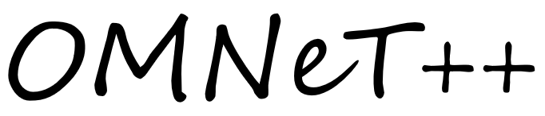

  

  实用<b>OMNeT++5</b>编程手册

  
  
  

# 文档说明

<b>omnetpp_primer-zh.pdf</b>记录了我在设计无人机蜂群网络仿真过程中，从初学<b>OMNeT++</b>软件到能灵活使用各种接口所遇到的各种问题，其中也从官方提供的手册中提取出较为常用的接口进行说明，提供一些实用的接口使用方法，最后将其总结成文档回馈开源。 
由于我水平有限，难免会存在理解错误的地方，欢迎读者发邮件指出，如果有其他宝贵的建议，也欢迎发邮件交流，希望这个文档能帮助更多的开发者。 
部分文件说明如下：

- dirtree：工程目录树文件，陈列了当前工程各目录下子文件结构
- img：omnetpp_primer-zh文档所需图片
- latexbook：omnetpp_primer-zh文档LaTex排版（目前未排版完）
- pdf：omnetpp_primer-zh文档pdf格式
- scripts：环境搭建
- Makefile：生成pdf

# 下载地址

本文档不定时更新，欢迎到[https://github.com/wangrongwei/omnetpp_primer/pdf](<https://github.com/wangrongwei/omnetpp_primer/tree/master/pdf>)下载最新的omnetpp_primer-zh.pdf，如果你想自己编译生成PDF文件，可按照BUILD.md说明搭建编译环境并通过执行make all生成文档。 

# TODO

- 如何使用cTopology类遍历网络的拓扑来初始化路由表?
- 如何在OMNeT++上使用OpenSceneGraph
- 如何从仿真场景读取节点的坐标
- 复合模块初始化时，先初始化节点的顺序
- 在initialize()中初始化类成员数组与在其他函数中的不同

# 贡献者

| 贡献者 | 贡献内容 |
| ------ | -------- |
| @rongwei | 编写第一、二到七部分以及其他一些文章、完善 pdf 格式排版 |
| @Stephenhua | 维护chapter_7.md |
| @Kmtalexwang | 维护omnetpp_primer-zh.pdf的LaTeX排版 |
| @Ericsyoung | 维护chapter_6.md仿真结果分析 |
| @hjtczyj | 文档修改 |

欢迎小伙伴们加入:-)

# 勘误

如果您发现有关技术上的错误或有必要纠正的内容，欢迎发邮件指出。目前文档正在组织中，借鉴了网上相关资料，在这里表示感谢！后续在慢慢加上相关引用。

# 授权许可

GNU FDL 1.3 （GNU 自由文档许可证）

[travis-image]: https://api.travis-ci.org/wangrongwei/omnetpp_primer.svg
[travis-url]: https://travis-ci.org/wangrongwei/omnetpp_primer
[npm-image]: https://img.shields.io/npm/v/omnetpp_primer.svg
[npm-url]: https://npmjs.org/package/omnetpp_primer
[downloads-image]: https://img.shields.io/npm/dm/omnetpp_primer.svg
[downloads-url]: https://npmjs.org/package/omnetpp_primer
