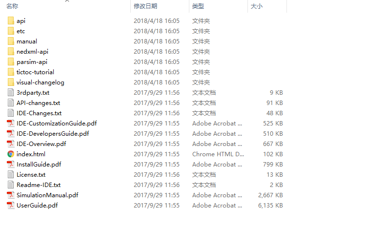

# 2.1 OMNeT++下载
&#160; &#160; &#160; &#160; OMNeT++可以直接从网上下载，网站地址是：
[https://www.omnetpp.org](),
但是国内直接从该网站下载，下载较慢，同时时常在安装下载过程中出现下载中断的情况，导致前功尽弃，下载成功较难。读者可直接到作者的GitHub:  下载版本OMNeT++5.2。

# 2.2 OMNeT++安装

## 2.2.1 安装准备
&#160; &#160; &#160; &#160; 由于OMNeT++支持多个操作系统环境的安装，包括MacOS、linux和Windows，在这里只描述Windows环境下的安装。
软件的安装说明肯定在软件的安装文件有说明，我们没有必要每次安装一个软件的时候都去百度一下软件安装的过程，作者的观点是对于一些破解较难，安装复杂的软件安装可以写写blog，记录记录。我们可以在OMNeT++的安装包下发现readme文件和doc目录下的installguide，去看看吧，总会发现我们的安装执行步骤，掌握这种办法，断网了也能安装、无论过多久还能记得安装过程。好了，废话不多说了。
下面是几个你在安装过程中可能会用到的命令：

- [1] **./configure**

&#160; &#160; &#160; &#160; 在PC机上第一次安装的时候，需要根据配置文件配置一下具体我们需要的软件的功能：静态编译程序、依赖库路径、其他什么文件路径

- [2] **make**

&#160; &#160; &#160; &#160; 在PC机上第一次安装的时候，需要根据配置文件配置一下具体我们需要的软件的功能：静态编译程序、依赖库路径、其他什么文件路径

- [3] **make clean**  

&#160; &#160; &#160; &#160; 清除前面安装过程中产生的中间二进制文件，这个命令主要用于重新安装软件的过程中，如果遇到make出错的问题，可以选择这个命令清除到二进制文件，然后在使用make命令编译安装（因为有些时候下载的安装包不是原始文件）。

## 2.2.2 图文并茂
&#160; &#160; &#160; &#160;  其实这一部分没有说明必要，姑且就当作者无聊，还是想写写，作者的原则就是坚持把故事讲得透彻明白，有些时候，在阅读别人博客的时候，老是会有很多疑问，其实博主以为读者懂，但读者的专业背景不一样，导致可能很简单的问题，还得下边留个言......好了，我们还是回到本节的话题上。

&#160; &#160; &#160; &#160; 以下三张图：

 

图片可真不好截，三张图片大小不一，以后再完善吧。以上三张图标识的三个文件是OMNeT++团队提供给开发者的基本帮助文档，作者在写这个文档的时候，自我认为都还没有把这些文档翻完，慢慢的，觉得这些资料本身已经够用了......作者会在后续的文档中，描述一下OMNeT++提供给我们的地图。
