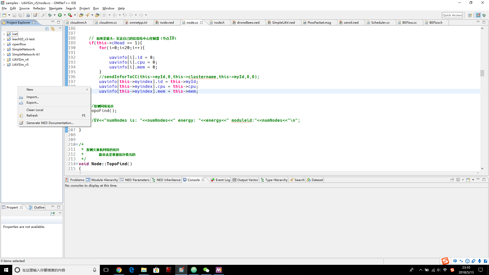
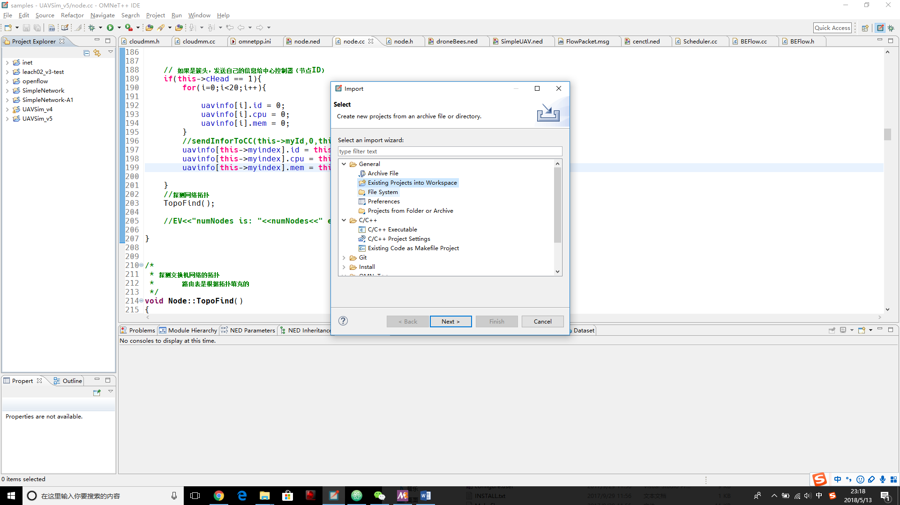
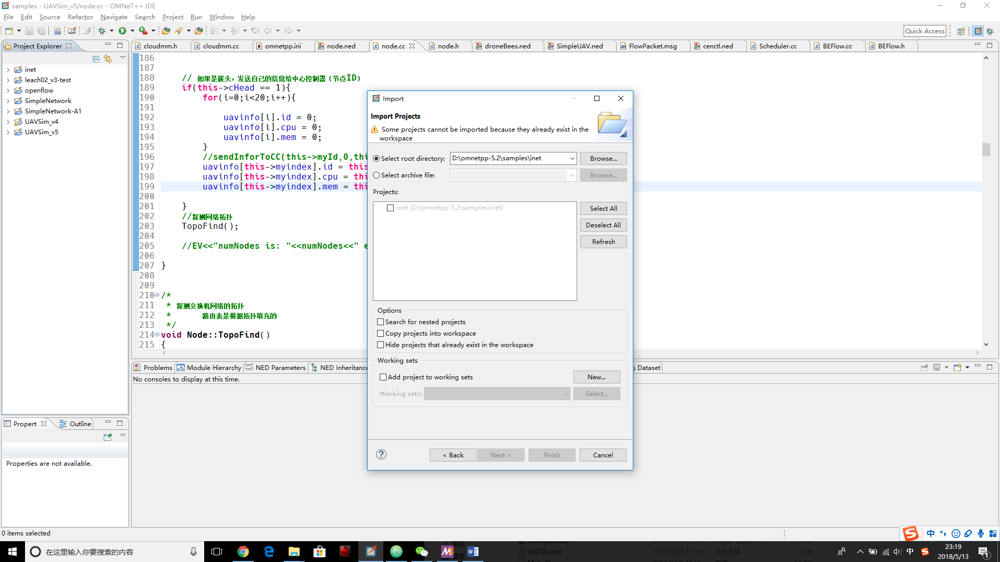
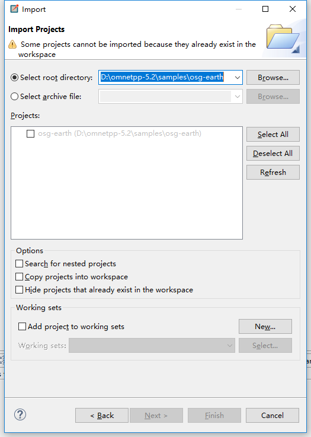

# 2.1 OMNeT++下载
&#160; &#160; &#160; &#160;<b>OMNeT++</b>可以直接从网上下载，网站地址是：
[https://www.omnetpp.org](),
但是国内直接从该网站下载，下载较慢，同时时常在安装下载过程中出现下载中断的情况，导致前功尽弃，下载成功较难。读者可直接到作者的GitHub:  下载版本**OMNeT++ 5.2**。

# 2.2 OMNeT++安装

## 2.2.1 安装准备
&#160; &#160; &#160; &#160;由于<b>OMNeT++</b>支持多个操作系统环境的安装，包括**MacOS**、**linux**和**Windows**，在这里只描述**Windows**环境下的安装。
软件的安装说明肯定在软件的安装文件有说明，我们没有必要每次安装一个软件的时候都去百度一下软件安装的过程，作者的观点是对于一些破解较难，安装复杂的软件安装可以写写blog，记录记录。我们可以在<b>OMNeT++</b>的安装包下发现readme文件和doc目录下的installguide，去看看吧，总会发现我们的安装执行步骤，掌握这种办法，断网了也能安装、无论过多久还能记得安装过程。好了，废话不多说了。
下面是几个你在安装过程中可能会用到的命令：

- [1] **./configure**

&#160; &#160; &#160; &#160;在PC机上第一次安装的时候，需要根据配置文件配置一下具体我们需要的软件的功能：静态编译程序、依赖库路径、其他什么文件路径

- [2] **make**

&#160; &#160; &#160; &#160;在PC机上第一次安装的时候，需要根据配置文件配置一下具体我们需要的软件的功能：静态编译程序、依赖库路径、其他什么文件路径


- [3] **make clean**  

&#160; &#160; &#160; &#160;清除前面安装过程中产生的中间二进制文件，这个命令主要用于重新安装软件的过程中，如果遇到make出错的问题，可以选择这个命令清除到二进制文件，然后在使用make命令编译安装（因为有些时候下载的安装包不是原始文件）。

## 2.2.2 图文并茂
&#160; &#160; &#160; &#160;其实这一部分没有说明必要，姑且就当作者无聊，还是想写写，作者的原则就是坚持把故事讲得透彻明白，有些时候，在阅读别人博客的时候，老是会有很多疑问，其实博主以为读者懂，但读者的专业背景不一样，导致可能很简单的问题，还得下边留个言......好了，我们还是回到本节的话题上。</br>
&#160; &#160; &#160; &#160; 以下三张图：

<div align="center">


<b>图2-4-1 doc目录</b>

</div>


&#160; &#160; &#160; &#160;上图文件是<b>OMNeT++</b>团队提供给开发者的基本帮助文档，作者在写这个文档的时候，自我觉得还没有把这些文档都翻开看一遍，查阅这些文档久了，就会慢慢觉得这些资料本身已经够用了......作者会在后续的文档中，描述一下<b>OMNeT++</b>提供给我们的地图。


# 2.3 INET库

## 2.3.1 INET库的介绍
&#160; &#160; &#160; &#160; 从一个初学者的角度，当安装<b>OMNeT++</b>后，大多数的情况下是需要安装INET库的，这个集成库包含了丰富的仿真模型，多数时候，读者如果设计一个网络仿真程序，有不想重新编写代码，这时候，可以在INET下寻找是否有满足要求的example，包括的网络有：

- adhoc
- aodv
- ethernet
- ipv6

等等，上面列举出的只是其中经常用到的一小部分，但是这也存在读者的不同研究背景，可能其中涉及的还不算很全。目前，作者，对于INET的使用较浅薄，水平还停留在调用INET库中的ned文件中的节点类型，或者其他诸如移动模型的水平上。在该小节，作者先为读者描述一下如何在<b>OMNeT++</b>下快速的使用INET库和目前作者的经常使用的技巧。


## 2.3.2 INET库的安装
&#160; &#160; &#160; &#160;通常有两种方法安装INET，在安装之前，首先需要到:
[https://inet.omnetpp.org]()
下载合适的版本，由于前面的<b>OMNeT++</b>使用的5.2的版本，这里我们可以选择**inet-3.6.2**，下载结束以后，将inet解压到omnetpp的安装路径下的samples文件下，此时inet文件的路径可能是：
**xxx/omnetpp-5.2/samples/inet**
(解压INET-3.6.2文件后只有一个inet文件)。接下来，我们需要：
- 方法一：命令窗口安装INET

&#160; &#160; &#160; &#160;其实，如果需要为omnetpp安装新的插件或者库，都可以通过命令行的形式进行安装，甚至，你可以在命令行的环境下对编写好的网络进行编译和运行。
&#160; &#160; &#160; &#160;作者编写这个学习手册的原则，就是为读者提供一个学习<b>OMNeT++</b>的地图，而不是一般详细字典，可能作者的水平还远远没有达到写一本学习<b>OMNeT++</b>的大全。首先，安装这个INET库，我们到inet文件下看看有什么有用的文件没有，当然是先看看**README.md**了，这个文件提示我们安装请看：**INSTALL**，下面是这个INSTALL的英文：
```
If you are building from command line:
--------------------------------------
3. Change to the INET directory.

4. Type "make makefiles". This should generate the makefiles for you automatically.

5. Type "make" to build the inet executable (debug version). Use "make MODE=release"
   to build release version.

6. You can run specific examples by changing into the example's directory and executing "./run"

```
当然，你可以选择**mingwenv.cmd**命令窗口，输入以上指令进行编译安装。上面的英文安装较为简洁，下面是作者使用命令窗口安装的过程：

- [1] 在安装INET库之前，应先确保OMNeT++已经安装成功。进入到<b>OMNeT++</b>安装路径，找到**mingwenv.cmd**文件，双击执行，进入下图：

<div align="center">


 </div>

- [2] 接下来，使用命令：**cd samples/inet**，进入到samples下的inet，另可使用ls命令查看当前inet文件下各子文件。

- [3] 然后，执行**make makefiles**命令生成编译整个inet库的makefile文件，结束以后输入命令**make**。到这来，使用命令窗口编译inet库就结束了。
- [4] 最后需要在<b>OMNeT++ IDE</b>中Project Explore窗口空白处右击, 如图，使用Import功能导入已经编译好的inet库。过程如下图：

<div align="center">




 </div>


- 方法二：OMNeT++窗口安装

&#160; &#160; &#160; &#160;一样的，在**INSTALL**下命令行安装方式下面就是使用IDE的安装方式，这个IDE的使用方式就是将INET库使用<b>OMNeT++</b>打开，当然此时库文件inet已经在**samples**文件下，我们需要做的就是打开<b>OMNeT++ IDE</b> ，然后导入整个inet工程。
```
If you are using the IDE:
-------------------------
3. Open the OMNeT++ IDE and choose the workspace where you have extracted the inet directory.
   The extracted directory must be a subdirectory of the workspace dir.

4. Import the project using: File | Import | General | Existing projects into Workspace.
   Then select the workspace dir as the root directory, and be sure NOT to check the
   "Copy projects into workspace" box. Click Finish.

5. Open the project (if already not open) and wait until the indexer finishes.
   Now you can build the project by pressing CTRL-B (Project | Build all)

6. To run an example from the IDE open the example's directory in the Project Explorer view,
   find the corresponding omnetpp.ini file. Right click on it and select Run As / Simulation.
   This should create a Launch Configuration for this example.

If the build was successful, you may try running the demo simulations.
Change into examples/ and type "./rundemo".

```
&#160; &#160; &#160; &#160;根据上面的步骤，需要点击：**File | Import | General | Existing projects into Workspace** ，导入inet整个工程文件，对整个工程进行编译即可。


# 2.4 常规使用

## 2.4.1 导入工程
&#160; &#160; &#160; &#160;其实作者觉得还是有必要把这一小节的内容加入其中，考虑了一下，这个软件的有些操作还是不太一样，可能初学者自己去找需要花大量的时间。</br>
&#160; &#160; &#160; &#160;在学习如何导入工程前，先观察一张图：

<div align="center">


<b>图2-4-1 IDE视图</b>

</div>

&#160; &#160; &#160; &#160;图2-4-1中，左边窗口为**Project Explorer**，在软件安装首次打开**IDE**时，**Project Explorer**中已经默认有相关的**samples**目录下的工程，如果开发者想要打开已有的工程，需要在**Project Explorer**窗口空白处右击鼠标，进行**Import | General | Existing Projects into Workspace**，最后选择工程文件即可，不需要任何设置直接**finish**即可。其中相关的中间过程如下：

<div align="center">


<b>图2-4-2 点击Import后视图</b>

</div>

<div align="center">



<b>图2-4-3 点击Existing Projects into Workspace后视图</b>

</div>

&#160; &#160; &#160; &#160;前面已经描述了相关过程，需要注意的是保证工程文件**不要放在有中文名的路径**下，如果包括的中文路径，在后期编译工程时，可能在**ned**文件下出现大量错误，无法识别**ned**文件路径。


## 2.4.2 程序执行与调试
&#160; &#160; &#160; &#160;导入了工程，如何执行程序和调试还是很重要的，尤其是对于<b>OMNeT++</b>工程，在**omnetpp**工程下有三种文件：**ned 、cpp和ini**，下面是这三种文件的介绍：
- **ned** ： 网络拓扑描述文件、简单节点模型和复合节点模型；
- **cpp** ： cpp文件为描述简单节点编程，定义简单节点各种行为；
- **ini** ： ned文件中相关参数的配置，在ned文件中一般会设置诸如节点数量的变量，一般有默认值，但是为了修改方便，可以在ini文件里边直接配置修改；
- **msg** ： 消息描述文件，会被opp_msgc转化成*_m.cc/h文件。</br>

&#160; &#160; &#160; &#160;为了更好的说明以上三种文件在一个工作里边的关系，下面展示一张图：
<div align="center">


<b>图2-4-4 编译与执行仿真流程</b>

</div>

&#160; &#160; &#160; &#160;这张图还是比较重要的，尤其是当你发现你的ned或者ini文件不启作用的时候，可以根据上面的仿真程序流程思考一下找到bug所在。再这张图中，可以看出**Simulation program**就是我们工程生成的可执行文件**exe**，也许读者会发现在我们执行程序的时候有两种选择：

- **Local C/C++ Application**
- **OMNeT++ Simulation**

&#160; &#160; &#160; &#160;这两种方式执行仿真程序有何不同了，结合**图2-4-4**，选择第一种执行方式其实就是执行的**Simulation program**，但是这种执行方式运行的仿真程序没有加入**ned**文件和**ini**配置文件，因此就是模型节点参数没有配置好或者就没有配置。第二种执行方式就比较完整了，其模型加入了**ned**文件和**ini**配置文件。其他类似问题读者可自行揣测。</br>
&#160; &#160; &#160; &#160;前面介绍这么多，还是直接说主题吧。我们执行<b>OMNeT++</b>工程大致有三种方式：
- [1] 直接右击工程文件->**RUN as**->**Local C/C++ Application** 或者**OMNeT++ Simulation**；</br>
- [2] 选中描述网络的**ned**文件，右击执行上面一样的操作；
- [3] 选择配置网络参数的**omnetppp.ini**文件，右击执行上面一样的操作。</br>

&#160; &#160; &#160; &#160;对于上面执行工程的后两种方式一般都是可以的，但是对于第一种方式来说，需要执行**exe**文件直接在工程目录下，不能在工程目录的子文件中，否则就只能选择后面两种执行方式。</br>
&#160; &#160; &#160; &#160;关于<b>OMNeT++</b>工程如何调试不在说明，其调试的方式与程序执行的方式相似，同时与其他程序的调试一样使用**gdb**调试，其中设置断点、单步调试或者进入函数内部等基本一样，以及添加观察变量。
